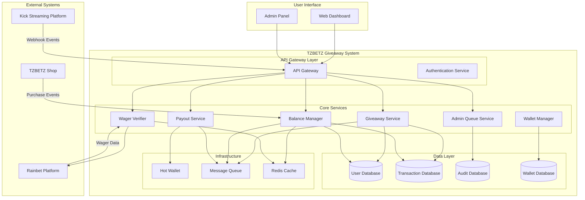

# Design Document: TZBETZ Crypto Giveaway System

## Overview

The TZBETZ Crypto Giveaway System is a comprehensive reward management platform that handles the complete flow from stream giveaway wins to crypto payouts. The system integrates with Kick streaming platform for giveaway events, manages user balances, enforces monthly wager requirements through Rainbet platform integration, provides admin approval workflows, and executes instant crypto payouts through a hot wallet system.

The architecture follows a microservices approach with clear separation between event processing, balance management, wager verification, approval workflows, and payout execution. The system prioritizes security through multi-layer validation, manual approval processes, and comprehensive audit logging.

## Architecture

### High-Level Architecture



### Service Communication

The system uses a hybrid communication pattern:
- **Synchronous**: REST APIs for user-facing operations and admin functions
- **Asynchronous**: Message queues for event processing and background tasks
- **Real-time**: WebSocket connections for live balance updates and notifications

## Components and Interfaces

### 1. Giveaway Service

**Responsibilities:**
- Process incoming giveaway events from Kick platform
- Validate giveaway authenticity and prevent duplicates
- Credit rewards to user balances
- Send notifications to users

**Key Interfaces:**
```typescript
interface GiveawayService {
  processGiveawayEvent(event: KickGiveawayEvent): Promise<GiveawayResult>
  validateGiveawayEvent(event: KickGiveawayEvent): Promise<boolean>
  creditReward(userId: string, amount: number, source: string): Promise<void>
}

interface KickGiveawayEvent {
  eventId: string
  streamId: string
  userId: string
  amount: number
  timestamp: Date
  signature: string
}
```

### 2. Balance Manager

**Responsibilities:**
- Maintain user balance records
- Process balance updates (credits/debits)
- Provide real-time balance information
- Handle shop integration transactions

**Key Interfaces:**
```typescript
interface BalanceManager {
  getBalance(userId: string): Promise<UserBalance>
  creditBalance(userId: string, amount: number, source: string): Promise<void>
  debitBalance(userId: string, amount: number, reason: string): Promise<boolean>
  getTransactionHistory(userId: string): Promise<Transaction[]>
}

interface UserBalance {
  userId: string
  availableBalance: number
  pendingBalance: number
  lastUpdated: Date
}
```

### 3. Wager Verifier

**Responsibilities:**
- Check monthly wager requirements against Rainbet platform
- Track wager progress and reset monthly
- Validate withdrawal eligibility
- Manage dynamic wager requirement scaling

**Key Interfaces:**
```typescript
interface WagerVerifier {
  checkWagerRequirement(userId: string, withdrawalAmount: number): Promise<WagerStatus>
  getWagerProgress(userId: string): Promise<WagerProgress>
  resetMonthlyWagers(): Promise<void>
  updateWagerRequirements(newRequirements: WagerRequirement[]): Promise<void>
}

interface WagerStatus {
  eligible: boolean
  requiredWager: number
  completedWager: number
  remainingWager: number
}
```

### 4. Admin Queue Service

**Responsibilities:**
- Manage withdrawal approval queue
- Provide admin interface for review
- Track approval/rejection decisions
- Maintain audit trail

**Key Interfaces:**
```typescript
interface AdminQueueService {
  addToQueue(request: WithdrawalRequest): Promise<string>
  getQueuedRequests(): Promise<WithdrawalRequest[]>
  approveRequest(requestId: string, adminId: string): Promise<void>
  rejectRequest(requestId: string, adminId: string, reason: string): Promise<void>
}

interface WithdrawalRequest {
  requestId: string
  userId: string
  amount: number
  wagerStatus: WagerStatus
  timestamp: Date
  status: 'pending' | 'approved' | 'rejected'
}
```

### 5. Wallet Manager

**Responsibilities:**
- Monitor hot wallet balance
- Execute crypto transactions
- Handle wallet security and key management
- Manage transaction confirmations

**Key Interfaces:**
```typescript
interface WalletManager {
  getWalletBalance(): Promise<number>
  sendTransaction(toAddress: string, amount: number): Promise<TransactionResult>
  getTransactionStatus(txHash: string): Promise<TransactionStatus>
  replenishWallet(amount: number): Promise<void>
}

interface TransactionResult {
  txHash: string
  status: 'pending' | 'confirmed' | 'failed'
  confirmations: number
}
```

### 6. Payout Service

**Responsibilities:**
- Orchestrate the complete payout flow
- Coordinate between wallet manager and Rainbet platform
- Handle payout failures and retries
- Send payout confirmations

**Key Interfaces:**
```typescript
interface PayoutService {
  executePayout(request: WithdrawalRequest): Promise<PayoutResult>
  retryFailedPayout(payoutId: string): Promise<PayoutResult>
  getPayoutStatus(payoutId: string): Promise<PayoutStatus>
}

interface PayoutResult {
  payoutId: string
  success: boolean
  txHash?: string
  errorMessage?: string
}
```

## Data Models

### User Model
```typescript
interface User {
  userId: string
  kickUserId: string
  rainbetUserId: string
  email: string
  createdAt: Date
  status: 'active' | 'suspended' | 'banned'
  withdrawalLimits: WithdrawalLimits
}

interface WithdrawalLimits {
  dailyLimit: number
  monthlyLimit: number
  currentDailyUsed: number
  currentMonthlyUsed: number
}
```

### Transaction Model
```typescript
interface Transaction {
  transactionId: string
  userId: string
  type: 'credit' | 'debit'
  amount: number
  source: 'giveaway' | 'shop' | 'withdrawal' | 'adjustment'
  status: 'pending' | 'completed' | 'failed'
  metadata: Record<string, any>
  createdAt: Date
  completedAt?: Date
}
```

### Wager Tracking Model
```typescript
interface WagerTracking {
  userId: string
  month: string // YYYY-MM format
  totalWager: number
  requirements: {
    tier5: number    // $5 withdrawal requirement
    tier10: number   // $10 withdrawal requirement
    tier20: number   // $20 withdrawal requirement
    tier100: number  // $100 withdrawal requirement
  }
  lastUpdated: Date
}
```

### Audit Log Model
```typescript
interface AuditLog {
  logId: string
  userId?: string
  adminId?: string
  action: string
  details: Record<string, any>
  ipAddress: string
  userAgent: string
  timestamp: Date
}
```

## Correctness Properties

*A property is a characteristic or behavior that should hold true across all valid executions of a system—essentially, a formal statement about what the system should do. Properties serve as the bridge between human-readable specifications and machine-verifiable correctness guarantees.*

Based on the prework analysis, the following properties capture the essential correctness guarantees of the system:

### Property 1: Giveaway Processing Idempotency
*For any* giveaway event, processing the same event multiple times should result in exactly one balance credit, preventing duplicate rewards.
**Validates: Requirements 1.4**

### Property 2: Balance Consistency
*For any* user and sequence of balance operations (credits, debits, shop purchases), the displayed balance should always equal the sum of all completed transactions.
**Validates: Requirements 1.1, 2.1, 2.3, 8.2**

### Property 3: Transaction Completeness
*For any* system operation that affects user state (giveaway processing, withdrawals, shop purchases), a corresponding audit record should be created with complete metadata.
**Validates: Requirements 1.2, 5.5, 10.3**

### Property 4: Withdrawal Validation
*For any* withdrawal request, the system should verify sufficient balance and appropriate wager completion before proceeding to admin approval.
**Validates: Requirements 3.2, 4.1**

### Property 5: Monthly Wager Reset
*For any* month transition, all user wager progress should be reset to zero while maintaining historical records.
**Validates: Requirements 4.3**

### Property 6: Admin Approval Workflow
*For any* withdrawal request that meets wager requirements, the request should be queued for admin review with complete user and wager information.
**Validates: Requirements 5.1, 5.2**

### Property 7: Rejection Recovery
*For any* rejected withdrawal request, the amount should be restored to the user's balance and the user should be notified.
**Validates: Requirements 5.4**

### Property 8: Hot Wallet Balance Checking
*For any* approved withdrawal, the system should verify hot wallet sufficiency before attempting payout.
**Validates: Requirements 6.1, 6.2**

### Property 9: Payout Execution
*For any* withdrawal with sufficient hot wallet balance, the crypto transaction should be initiated and confirmed with the user.
**Validates: Requirements 7.1, 7.2**

### Property 10: Transaction Verification
*For any* initiated crypto transaction, the system should verify completion with the Rainbet platform and handle failures appropriately.
**Validates: Requirements 7.3, 7.4**

### Property 11: Shop Integration Consistency
*For any* shop transaction, the balance deduction and shop credit should be synchronized, with rollback on failure.
**Validates: Requirements 8.3, 8.4**

### Property 12: Rate Limiting Enforcement
*For any* user making multiple withdrawal requests, the system should enforce rate limits and prevent abuse.
**Validates: Requirements 10.1**

### Property 13: Security Response
*For any* pattern of suspicious activity or failed attempts, the system should implement appropriate security measures.
**Validates: Requirements 10.2, 10.4**

### Property 14: Data Encryption
*For any* sensitive user data or transaction information, the system should apply encryption before storage or transmission.
**Validates: Requirements 10.5**

### Property 15: Real-time Updates
*For any* balance change or system state update, connected users should receive real-time notifications.
**Validates: Requirements 1.3, 2.2**

<function_calls>
<invoke name="prework">
<parameter name="featureName">crypto-giveaway-system

## Error Handling

### Error Categories

**1. External System Failures**
- Kick platform webhook failures
- Rainbet API unavailability
- TZBETZ Shop integration errors
- Hot wallet connectivity issues

**2. Validation Errors**
- Insufficient balance for withdrawals
- Unmet wager requirements
- Invalid giveaway events
- Duplicate transaction attempts

**3. Security Violations**
- Rate limit exceeded
- Suspicious activity patterns
- Failed authentication attempts
- Invalid transaction signatures

**4. System Errors**
- Database connectivity issues
- Message queue failures
- Cache unavailability
- Service timeouts

### Error Handling Strategies

**Retry Mechanisms:**
- Exponential backoff for external API calls
- Circuit breaker pattern for service dependencies
- Dead letter queues for failed message processing
- Automatic retry for transient failures

**Graceful Degradation:**
- Cache fallback for balance queries
- Queue requests during external system outages
- Read-only mode during database issues
- Manual approval bypass for critical withdrawals

**User Communication:**
- Clear error messages for validation failures
- Status updates during system maintenance
- Notification of delayed processing
- Alternative action suggestions

**Monitoring and Alerting:**
- Real-time error rate monitoring
- Automated alerts for critical failures
- Performance degradation detection
- Security incident notifications

## Testing Strategy

### Dual Testing Approach

The system requires both unit testing and property-based testing for comprehensive coverage:

**Unit Tests:**
- Specific examples and edge cases
- Integration points between services
- Error conditions and failure scenarios
- Mock external system responses

**Property Tests:**
- Universal properties across all inputs
- Comprehensive input coverage through randomization
- Minimum 100 iterations per property test
- Each test tagged with corresponding design property

### Property-Based Testing Configuration

**Testing Framework:** We will use a property-based testing library appropriate for the chosen implementation language (e.g., Hypothesis for Python, fast-check for TypeScript, QuickCheck for Haskell).

**Test Configuration:**
- Minimum 100 iterations per property test
- Custom generators for domain objects (users, transactions, giveaway events)
- Shrinking enabled for minimal failing examples
- Deterministic seeds for reproducible test runs

**Property Test Tagging:**
Each property-based test must include a comment tag referencing its design document property:
- Format: **Feature: crypto-giveaway-system, Property {number}: {property_text}**
- Example: **Feature: crypto-giveaway-system, Property 1: Giveaway Processing Idempotency**

### Integration Testing

**External System Mocking:**
- Kick platform webhook simulation
- Rainbet API response mocking
- TZBETZ Shop transaction simulation
- Hot wallet transaction mocking

**End-to-End Scenarios:**
- Complete giveaway-to-payout flow
- Shop purchase integration
- Admin approval workflows
- Error recovery scenarios

**Performance Testing:**
- Load testing for concurrent users
- Stress testing for high-volume giveaways
- Hot wallet balance monitoring under load
- Database performance under transaction volume

### Security Testing

**Penetration Testing:**
- Authentication bypass attempts
- Rate limiting validation
- Input validation testing
- SQL injection prevention

**Audit Trail Verification:**
- Complete transaction logging
- Admin action tracking
- Security event recording
- Data integrity validation