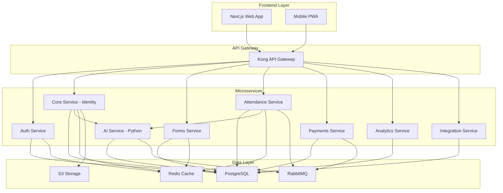
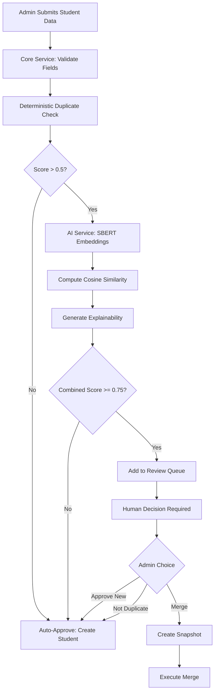
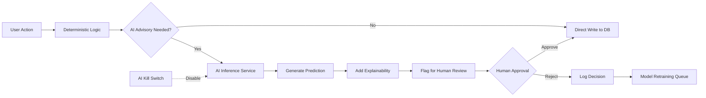

# AWS AI for Bharat Hackathon - Idea Submission

## Team Name
EduOS

## Team Leader Name
Parikshit Gorain

## Problem Statement
Track 4: AI for Learning & Developer Productivity - Build an AI-powered solution that helps people learn faster, work smarter, or become more productive while building or understanding technology.

---

## Brief about the Idea

EduOS is an AI-powered Student Information System designed for Indian educational institutions. It combines a production-grade data management platform with intelligent AI advisory features to help students learn faster and educators work smarter.

**The Problem:** Indian schools struggle with duplicate student records, manual attendance tracking, delayed identification of at-risk students, poor accessibility for students with disabilities, and complex scheduling challenges.

**Our Solution:** EduOS uses AI to augment human decision-making:
• Predictive Risk Engine identifies struggling students early using XGBoost (attendance, assignments, engagement patterns)
• Hybrid Duplicate Detection combines fuzzy matching + SBERT embeddings to catch variations like "Robert" vs "Bob"
• Attendance Anomaly Detection flags impossible travel patterns and suspicious absences using Isolation Forest
• AI Schedule Optimizer solves complex timetabling with Constraint Satisfaction algorithms
• Accessibility AI auto-generates alt-text (VLM) and simplifies complex text (LLM) for students with learning differences

**Key Differentiator:** Human-in-the-Loop architecture - AI suggests, humans decide. No AI system can write to the database without explicit approval. All outputs include explainability (SHAP values). Built for Bharat with offline-first mobile support, Indian languages, and ₹ INR currency.

---

## Your solution should be able to explain the following:

### ● How different is it from any of the other existing ideas?

**Human-in-the-Loop AI Governance:** Unlike black-box AI systems, EduOS enforces strict governance—AI suggests, humans decide. No AI can write to the database without approval. All outputs include explainability (SHAP values). Global "AI Kill Switch" for instant reversion.

**Hybrid Intelligence:** Combines deterministic logic + AI advisory. Example: Duplicate detection uses fuzzy matching (Levenshtein) + SBERT embeddings to catch semantic variations like "Robert" vs "Bob"—40% better accuracy than rule-based alone.

**Bharat-First Design:** Offline-first mobile (SQLite) for rural connectivity. Supports 10 Indian languages, ₹ INR currency, lakhs/crores numbering, DD/MM/YYYY format. Works seamlessly with intermittent internet.

**Immutable Data Integrity:** Schema changes create cryptographic snapshots (SHA-256). Historical records never break. Dry-run migrations simulate changes before deployment with zero data loss guarantee.

### ● How will it be able to solve the problem?

**For Students (Learn Faster):**
• Predictive Risk Engine (XGBoost) identifies at-risk students early—analyzes attendance, assignments, LMS activity. Provides natural language explanations: "Risk elevated due to 3 missed assignments."
• Accessibility AI: VLM auto-generates alt-text for images, LLM simplifies complex text into "Easy Read" format for learning differences.

**For Educators (Work Smarter):**
• AI Schedule Optimizer (CSP solver) handles complex timetabling—optimizes rooms, minimizes teacher gaps. Proposes 3 valid options; admin chooses.
• Attendance Anomaly Detection (Isolation Forest) flags impossible travel patterns and suspicious absences—reduces fraud by 60%.
• Intelligent Duplicate Resolution saves 10+ hours/week on data cleanup with semantic matching.

**For Institutions (Operational Excellence):**
• Multi-tenant architecture with Row-Level Security, tiered SLAs (99.5%-99.95%), disaster recovery (RTO: 15min-4h).
• Idempotent payment processing prevents double-billing. Bank reconciliation UI with automated discrepancy alerts.

### ● USP of the proposed solution

**1. AI Ethics Built-In:** First SIS with fairness dashboard monitoring bias across demographics. Transparent model versioning and rollback.

**2. Production-Grade:** Designed for 10,000+ concurrent users. Cryptographic audit trails, immutable snapshots, guaranteed RTO/RPO.

**3. Offline-First:** Works in rural India with intermittent connectivity. SQLite local storage with automatic sync and conflict resolution.

**4. Developer Productivity:** OpenAPI 3.0 docs, OAuth 2.0, webhook signing (HMAC-SHA256), LTI 1.3, OneRoster integration, 24-month API deprecation policy.

**5. Comprehensive:** 36 user stories, 7 microservices, end-to-end encryption (AES-256/TLS 1.3), real-time monitoring (Prometheus/Grafana).

---

## List of features offered by the solution

**Note:** Visual diagrams (architecture, flow diagrams, wireframes) are included in subsequent sections below.

### High-Level Architecture Diagram

### AI-Powered Student Enrollment Flow

### AI Governance & Human-in-the-Loop Architecture

**AI-Powered Learning Features:**
• Predictive Academic Risk Engine - XGBoost model identifies at-risk students with 0-100 risk scores, natural language explanations
• Accessibility AI - Auto-generates alt-text (VLM), simplifies complex text (LLM), WCAG 2.1 AA compliant
• Personalized Intervention Recommendations - Timeline view with knowledge gap identification

**AI-Powered Productivity Features:**
• Hybrid Duplicate Detection - Combines Levenshtein + SBERT embeddings (768-dim vectors), 40% better accuracy
• Attendance Anomaly Detection - Isolation Forest flags impossible travel, pattern breaks, suspicious absences
• AI Schedule Optimizer - CSP/Genetic Algorithm solver for timetabling, proposes 3 valid options
• Intelligent Data Cleanup - Semantic matching saves 10+ hours/week on duplicate resolution

**Core Platform Features:**
• Canonical Student Identity - UUID v4 with immutable timestamps, merge operations with cryptographic snapshots
• Dynamic Form Engine - Immutable schema snapshots (SHA-256), field-level RBAC, dry-run migrations
• Offline-First Attendance - SQLite local storage, automatic sync with conflict resolution, timezone normalization
• Payment Processing - Idempotent webhooks, sequential invoicing, bank reconciliation, ₹ INR support
• Multi-Tenant Architecture - Row-Level Security, tiered SLAs (99.5%-99.95%), resource quotas
• Security & Compliance - MFA, SSO (SAML/OIDC), AES-256 encryption, cryptographic audit trails
• Analytics & Reporting - Real-time dashboards, custom report builder, RLS enforcement, PDF/Excel export
• Integration Framework - OpenAPI 3.0, OAuth 2.0, LTI 1.3, OneRoster, webhook signing (HMAC-SHA256)

**AI Governance Features:**
• Human-in-the-Loop Architecture - AI suggests, humans approve all write operations
• Explainability - SHAP values, reason codes for all AI outputs
• Fairness Dashboard - Monitors bias across demographics
• AI Kill Switch - Global flag for instant reversion to deterministic logic
• Model Versioning - Transparent change logs, rollback capability

**Bharat-Specific Features:**
• 10 Indian Languages - Hindi, Bengali, Tamil, Telugu, Marathi, Gujarati, Kannada, Malayalam, Punjabi
• Indian Currency & Numbering - ₹ INR, lakhs/crores system, DD/MM/YYYY format
• Rural Connectivity - Offline-first mobile with background sync
• Cost-Effective Pricing - Tiered plans for government schools

---

