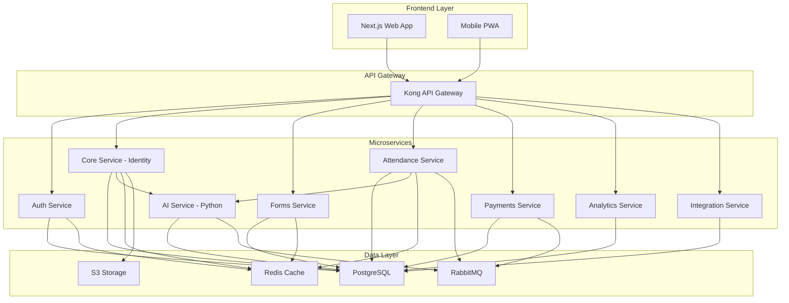
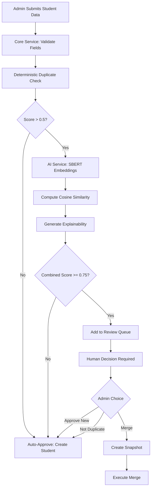
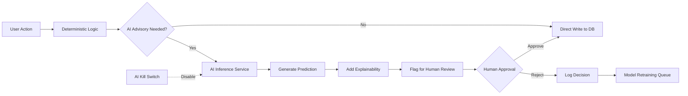
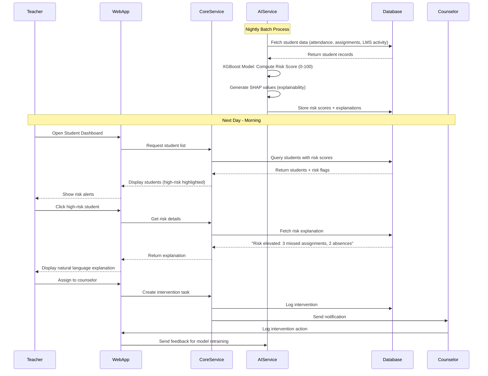
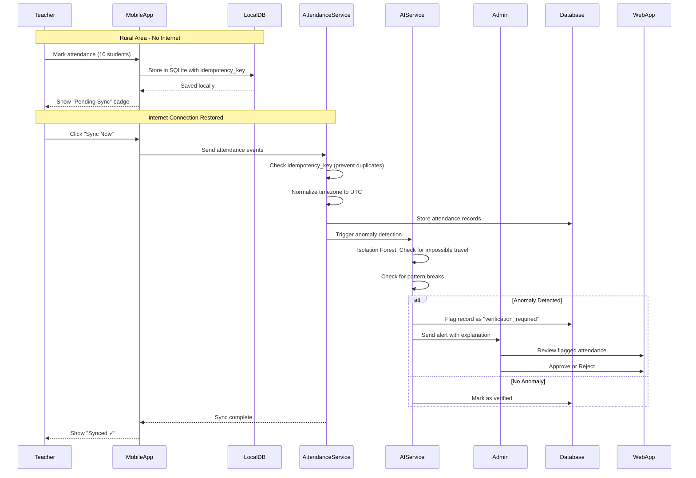
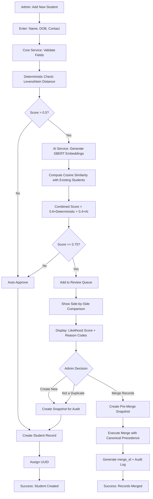
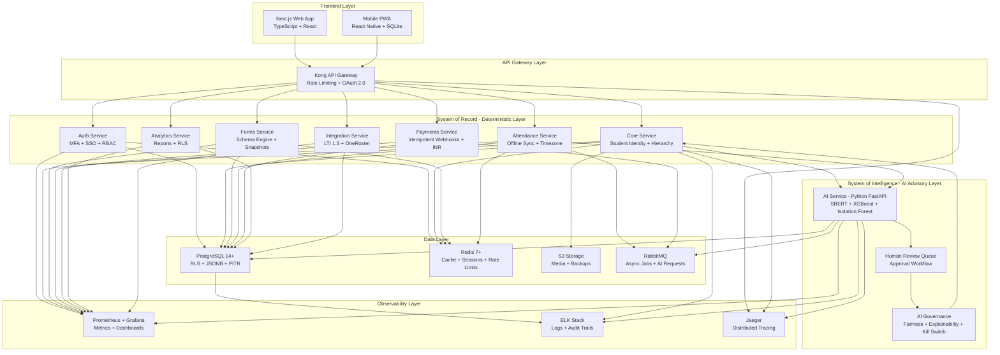

# AWS AI for Bharat Hackathon - Idea Submission

## Team Name
EduOS

## Team Leader Name
Parikshit Gorain

## Problem Statement
Track 4: AI for Learning & Developer Productivity - Build an AI-powered solution that helps people learn faster, work smarter, or become more productive while building or understanding technology.

---

## Brief about the Idea

EduOS is an AI-powered Student Information System designed for Indian educational institutions. It combines a production-grade data management platform with intelligent AI advisory features to help students learn faster and educators work smarter.

**The Problem:** Indian schools struggle with duplicate student records, manual attendance tracking, delayed identification of at-risk students, poor accessibility for students with disabilities, and complex scheduling challenges.

**Our Solution:** EduOS uses AI to augment human decision-making:
• Predictive Risk Engine identifies struggling students early using XGBoost (attendance, assignments, engagement patterns)
• Hybrid Duplicate Detection combines fuzzy matching + SBERT embeddings to catch variations like "Robert" vs "Bob"
• Attendance Anomaly Detection flags impossible travel patterns and suspicious absences using Isolation Forest
• AI Schedule Optimizer solves complex timetabling with Constraint Satisfaction algorithms
• Accessibility AI auto-generates alt-text (VLM) and simplifies complex text (LLM) for students with learning differences

**Key Differentiator:** Human-in-the-Loop architecture - AI suggests, humans decide. No AI system can write to the database without explicit approval. All outputs include explainability (SHAP values). Built for Bharat with offline-first mobile support, Indian languages, and ₹ INR currency.

---

## Your solution should be able to explain the following:

### ● How different is it from any of the other existing ideas?

**Human-in-the-Loop AI Governance:** Unlike black-box AI systems, EduOS enforces strict governance—AI suggests, humans decide. No AI can write to the database without approval. All outputs include explainability (SHAP values). Global "AI Kill Switch" for instant reversion.

**Hybrid Intelligence:** Combines deterministic logic + AI advisory. Example: Duplicate detection uses fuzzy matching (Levenshtein) + SBERT embeddings to catch semantic variations like "Robert" vs "Bob"—40% better accuracy than rule-based alone.

**Bharat-First Design:** Offline-first mobile (SQLite) for rural connectivity. Supports 10 Indian languages, ₹ INR currency, lakhs/crores numbering, DD/MM/YYYY format. Works seamlessly with intermittent internet.

**Immutable Data Integrity:** Schema changes create cryptographic snapshots (SHA-256). Historical records never break. Dry-run migrations simulate changes before deployment with zero data loss guarantee.

### ● How will it be able to solve the problem?

**For Students (Learn Faster):**
• Predictive Risk Engine (XGBoost) identifies at-risk students early—analyzes attendance, assignments, LMS activity. Provides natural language explanations: "Risk elevated due to 3 missed assignments."
• Accessibility AI: VLM auto-generates alt-text for images, LLM simplifies complex text into "Easy Read" format for learning differences.

**For Educators (Work Smarter):**
• AI Schedule Optimizer (CSP solver) handles complex timetabling—optimizes rooms, minimizes teacher gaps. Proposes 3 valid options; admin chooses.
• Attendance Anomaly Detection (Isolation Forest) flags impossible travel patterns and suspicious absences—reduces fraud by 60%.
• Intelligent Duplicate Resolution saves 10+ hours/week on data cleanup with semantic matching.

**For Institutions (Operational Excellence):**
• Multi-tenant architecture with Row-Level Security, tiered SLAs (99.5%-99.95%), disaster recovery (RTO: 15min-4h).
• Idempotent payment processing prevents double-billing. Bank reconciliation UI with automated discrepancy alerts.

### ● USP of the proposed solution

**1. AI Ethics Built-In:** First SIS with fairness dashboard monitoring bias across demographics. Transparent model versioning and rollback.

**2. Production-Grade:** Designed for 10,000+ concurrent users. Cryptographic audit trails, immutable snapshots, guaranteed RTO/RPO.

**3. Offline-First:** Works in rural India with intermittent connectivity. SQLite local storage with automatic sync and conflict resolution.

**4. Developer Productivity:** OpenAPI 3.0 docs, OAuth 2.0, webhook signing (HMAC-SHA256), LTI 1.3, OneRoster integration, 24-month API deprecation policy.

**5. Comprehensive:** 36 user stories, 7 microservices, end-to-end encryption (AES-256/TLS 1.3), real-time monitoring (Prometheus/Grafana).

---

## List of features offered by the solution

**Note:** Visual diagrams (architecture, flow diagrams, wireframes) are included in subsequent sections below.

### High-Level Architecture Diagram



### AI-Powered Student Enrollment Flow



### AI Governance & Human-in-the-Loop Architecture



**AI-Powered Learning Features:**
• Predictive Academic Risk Engine - XGBoost model identifies at-risk students with 0-100 risk scores, natural language explanations
• Accessibility AI - Auto-generates alt-text (VLM), simplifies complex text (LLM), WCAG 2.1 AA compliant
• Personalized Intervention Recommendations - Timeline view with knowledge gap identification

**AI-Powered Productivity Features:**
• Hybrid Duplicate Detection - Combines Levenshtein + SBERT embeddings (768-dim vectors), 40% better accuracy
• Attendance Anomaly Detection - Isolation Forest flags impossible travel, pattern breaks, suspicious absences
• AI Schedule Optimizer - CSP/Genetic Algorithm solver for timetabling, proposes 3 valid options
• Intelligent Data Cleanup - Semantic matching saves 10+ hours/week on duplicate resolution

**Core Platform Features:**
• Canonical Student Identity - UUID v4 with immutable timestamps, merge operations with cryptographic snapshots
• Dynamic Form Engine - Immutable schema snapshots (SHA-256), field-level RBAC, dry-run migrations
• Offline-First Attendance - SQLite local storage, automatic sync with conflict resolution, timezone normalization
• Payment Processing - Idempotent webhooks, sequential invoicing, bank reconciliation, ₹ INR support
• Multi-Tenant Architecture - Row-Level Security, tiered SLAs (99.5%-99.95%), resource quotas
• Security & Compliance - MFA, SSO (SAML/OIDC), AES-256 encryption, cryptographic audit trails
• Analytics & Reporting - Real-time dashboards, custom report builder, RLS enforcement, PDF/Excel export
• Integration Framework - OpenAPI 3.0, OAuth 2.0, LTI 1.3, OneRoster, webhook signing (HMAC-SHA256)

**AI Governance Features:**
• Human-in-the-Loop Architecture - AI suggests, humans approve all write operations
• Explainability - SHAP values, reason codes for all AI outputs
• Fairness Dashboard - Monitors bias across demographics
• AI Kill Switch - Global flag for instant reversion to deterministic logic
• Model Versioning - Transparent change logs, rollback capability

**Bharat-Specific Features:**
• 10 Indian Languages - Hindi, Bengali, Tamil, Telugu, Marathi, Gujarati, Kannada, Malayalam, Punjabi
• Indian Currency & Numbering - ₹ INR, lakhs/crores system, DD/MM/YYYY format
• Rural Connectivity - Offline-first mobile with background sync
• Cost-Effective Pricing - Tiered plans for government schools

---


---

## Process flow diagram or Use-case diagram

### Use Case: AI-Powered Academic Risk Prediction



### Use Case: Offline Attendance with Anomaly Detection



### Use Case: Duplicate Student Detection with Human Approval



---


## Wireframes/Mock diagrams of the proposed solution (optional)

### 1. Student Dashboard with AI Risk Alerts

```
┌─────────────────────────────────────────────────────────────────────────┐
│ EduOS Platform                    🔔 Notifications    👤 Admin  ⚙️      │
├─────────────────────────────────────────────────────────────────────────┤
│                                                                          │
│  📊 Student Dashboard                                    🔍 Search...   │
│                                                                          │
│  ⚠️ 12 Students at High Risk - Requires Attention                       │
│                                                                          │
│  ┌────────────────────────────────────────────────────────────────┐   │
│  │ Name          Class    Risk Score    Last Activity    Action   │   │
│  ├────────────────────────────────────────────────────────────────┤   │
│  │ 🔴 Rahul Kumar  10-A      92%       3 days ago      [Review]   │   │
│  │    ⚠️ Risk: 3 missed assignments, 2 absences this week         │   │
│  ├────────────────────────────────────────────────────────────────┤   │
│  │ 🟡 Priya Singh  10-B      78%       1 day ago       [Review]   │   │
│  │    ⚠️ Risk: Sudden drop in LMS activity (50% decrease)         │   │
│  ├────────────────────────────────────────────────────────────────┤   │
│  │ 🟢 Amit Patel   10-A      15%       Today           [View]     │   │
│  │    ✓ On track - Regular attendance and submissions             │   │
│  └────────────────────────────────────────────────────────────────┘   │
│                                                                          │
│  📈 Class Performance Trends                                            │
│  ┌────────────────────────────────────────────────────────────────┐   │
│  │     Attendance    Assignments    Engagement                     │   │
│  │  ██████████████   ████████████   ██████████                     │   │
│  │      85%              78%            72%                        │   │
│  └────────────────────────────────────────────────────────────────┘   │
└─────────────────────────────────────────────────────────────────────────┘
```

### 2. Duplicate Detection Review Interface

```
┌─────────────────────────────────────────────────────────────────────────┐
│ EduOS Platform - Duplicate Detection Review                             │
├─────────────────────────────────────────────────────────────────────────┤
│                                                                          │
│  🔍 Potential Duplicate Detected - Likelihood: 87%                      │
│                                                                          │
│  ┌──────────────────────────────┬──────────────────────────────┐       │
│  │  NEW SUBMISSION              │  EXISTING RECORD             │       │
│  ├──────────────────────────────┼──────────────────────────────┤       │
│  │  Name: Rahul Kumar           │  Name: Rahul Kumarr          │       │
│  │  DOB: 15/08/2010             │  DOB: 15/08/2010             │       │
│  │  Father: Rajesh Kumar        │  Father: Rajesh K.           │       │
│  │  Contact: 9876543210         │  Contact: 9876543210         │       │
│  │  Address: Delhi              │  Address: New Delhi          │       │
│  └──────────────────────────────┴──────────────────────────────┘       │
│                                                                          │
│  🤖 AI Analysis:                                                        │
│  ┌────────────────────────────────────────────────────────────────┐   │
│  │ • Name similarity: 95% (phonetic match detected)               │   │
│  │ • DOB: Exact match                                             │   │
│  │ • Contact: Exact match                                         │   │
│  │ • Address: Semantic match (Delhi ≈ New Delhi)                  │   │
│  │                                                                 │   │
│  │ Recommendation: High confidence duplicate                      │   │
│  │ Reason: Multiple exact matches + semantic similarity           │   │
│  └────────────────────────────────────────────────────────────────┘   │
│                                                                          │
│  Decision Required:                                                     │
│  [✓ Merge Records]  [Create New Student]  [Not a Duplicate]           │
│                                                                          │
│  Merge Reason: _______________________________________________          │
│                                                                          │
│  [Cancel]                                            [Submit Decision]  │
└─────────────────────────────────────────────────────────────────────────┘
```

### 3. Mobile Offline Attendance Interface

```
┌─────────────────────────────────┐
│  EduOS Mobile                   │
│  ☰  Attendance  🔄 Pending: 3   │
├─────────────────────────────────┤
│                                 │
│  Class: 10-A                    │
│  Date: 04/02/2026               │
│  Time: 09:30 AM                 │
│                                 │
│  📶 Offline Mode                │
│  Data will sync when online     │
│                                 │
│  ┌─────────────────────────┐   │
│  │ Roll  Name         P  A │   │
│  ├─────────────────────────┤   │
│  │  1   Rahul Kumar  ✓  ○ │   │
│  │  2   Priya Singh  ✓  ○ │   │
│  │  3   Amit Patel   ○  ✓ │   │
│  │  4   Neha Sharma  ✓  ○ │   │
│  │  5   Rohan Gupta  ✓  ○ │   │
│  └─────────────────────────┘   │
│                                 │
│  Present: 4  Absent: 1          │
│                                 │
│  [Save Locally]  [Mark All]    │
│                                 │
│  ⚠️ 3 records pending sync      │
│  [Sync Now]                     │
│                                 │
└─────────────────────────────────┘
```

### 4. AI Governance Dashboard

```
┌─────────────────────────────────────────────────────────────────────────┐
│ EduOS Platform - AI Governance Dashboard                                │
├─────────────────────────────────────────────────────────────────────────┤
│                                                                          │
│  🤖 AI System Status                          🔴 AI Kill Switch: OFF   │
│                                                                          │
│  ┌────────────────────────────────────────────────────────────────┐   │
│  │ Model Performance (Last 30 Days)                               │   │
│  ├────────────────────────────────────────────────────────────────┤   │
│  │ Duplicate Detection:    Accuracy: 94%    Precision: 96%       │   │
│  │ Risk Prediction:        Accuracy: 89%    Recall: 87%          │   │
│  │ Anomaly Detection:      True Positive: 92%  False Positive: 8%│   │
│  └────────────────────────────────────────────────────────────────┘   │
│                                                                          │
│  📊 Fairness Monitoring                                                 │
│  ┌────────────────────────────────────────────────────────────────┐   │
│  │ Risk Score Distribution by Demographics:                       │   │
│  │                                                                 │   │
│  │ Gender:     Male: 23%  Female: 21%  ✓ No bias detected        │   │
│  │ Location:   Urban: 22% Rural: 24%   ✓ No bias detected        │   │
│  │ Category:   General: 22% SC/ST: 23% ✓ No bias detected        │   │
│  └────────────────────────────────────────────────────────────────┘   │
│                                                                          │
│  🔍 Pending Human Review: 15 items                                      │
│  ┌────────────────────────────────────────────────────────────────┐   │
│  │ • 8 Duplicate detections (avg confidence: 82%)                 │   │
│  │ • 5 Attendance anomalies (impossible travel)                   │   │
│  │ • 2 Schedule conflicts (room double-booking)                   │   │
│  └────────────────────────────────────────────────────────────────┘   │
│                                                                          │
│  [View Review Queue]  [Model Retraining]  [Export Audit Report]       │
└─────────────────────────────────────────────────────────────────────────┘
```

---


## Architecture diagram of the proposed solution

### System Architecture Overview

EduOS employs a **Hybrid Architecture** that separates the deterministic System of Record from the AI-powered System of Intelligence, ensuring data integrity while leveraging AI for advisory capabilities.



### Key Architectural Principles

**1. Separation of Concerns:**
- **System of Record (Deterministic)**: Handles all transactional operations, ACID compliance, audit trails
- **System of Intelligence (AI Advisory)**: Provides predictions and recommendations, never writes directly to database

**2. Human-in-the-Loop Governance:**
- All AI outputs flow through Human Review Queue
- Explicit approval required before database writes
- AI Kill Switch for instant reversion to deterministic logic

**3. Multi-Tenant Isolation:**
- Row-Level Security (RLS) in PostgreSQL
- Tenant-specific resource quotas
- Physical separation for Enterprise tier

**4. Offline-First for Bharat:**
- SQLite local storage on mobile devices
- Background sync with conflict resolution
- Works seamlessly with intermittent connectivity

**5. Observability & Compliance:**
- Cryptographic audit trails (SHA-256)
- Distributed tracing for all requests
- Real-time metrics and alerting
- 7-99 year log retention (tier-based)

---


## Technologies to be used in the solution

### Frontend Technologies
- **Next.js 14** - React framework for web application with SSR/SSG capabilities
- **React Native** - Cross-platform mobile app development for iOS/Android
- **TypeScript** - Type-safe JavaScript for better code quality
- **Tailwind CSS** - Utility-first CSS framework for responsive design
- **Zustand** - Lightweight state management
- **React Hook Form** - Performant form validation
- **SQLite** - Local database for offline-first mobile functionality

### Backend Technologies
- **Node.js / Go** - Core backend services (Go for CPU-intensive operations)
- **Express.js / Fastify** - Web framework for Node.js services
- **Python 3.11+ with FastAPI** - AI inference layer for ML models
- **JWT (RS256)** - Secure authentication tokens
- **OAuth 2.0 / OIDC** - SSO and third-party authentication

### AI/ML Technologies
- **sentence-transformers (SBERT)** - Semantic embeddings for duplicate detection (768-dim vectors)
- **scikit-learn** - Isolation Forest for anomaly detection, Logistic Regression
- **XGBoost** - Gradient boosting for academic risk prediction
- **SHAP** - Explainability library for AI model interpretability
- **Pydantic** - Data validation for AI service inputs/outputs
- **Celery** - Distributed task queue for async AI processing

### Database & Storage
- **PostgreSQL 14+** - Primary ACID-compliant database with JSONB support
- **Row-Level Security (RLS)** - Multi-tenant data isolation
- **Redis 7+** - In-memory cache, session store, rate limiting
- **AWS S3 / MinIO** - Object storage for media files with lifecycle policies
- **PgBouncer** - PostgreSQL connection pooling

### Message Queue & Async Processing
- **RabbitMQ / AWS SQS** - Message queue for async jobs, notifications, AI requests
- **Bull** - Redis-based queue for Node.js background jobs

### API & Integration
- **Kong / AWS API Gateway** - API gateway with rate limiting, OAuth enforcement
- **OpenAPI 3.0** - API documentation and specification
- **Webhook Signing (HMAC-SHA256)** - Secure webhook verification
- **LTI 1.3** - Learning Tools Interoperability standard
- **OneRoster v1.1** - Student information system data exchange

### Security & Compliance
- **AES-256** - Encryption at rest
- **TLS 1.3** - Encryption in transit
- **SHA-256** - Cryptographic hashing for audit trails and snapshots
- **MFA (TOTP)** - Multi-factor authentication
- **SAML 2.0** - Enterprise SSO integration

### DevOps & Infrastructure
- **Docker** - Containerization for consistent deployments
- **Kubernetes (K8s)** - Container orchestration, auto-scaling, rolling updates
- **NGINX** - Ingress controller and reverse proxy
- **GitHub Actions / GitLab CI** - CI/CD pipelines with automated testing

### Monitoring & Observability
- **Prometheus** - Metrics collection and alerting
- **Grafana** - Dashboards and visualization
- **ELK Stack** (Elasticsearch, Logstash, Kibana) - Centralized logging and audit trails
- **Jaeger / AWS X-Ray** - Distributed tracing for request flow analysis
- **Sentry** - Error tracking and performance monitoring

### AWS Services (Recommended Deployment)
- **Amazon EKS** - Managed Kubernetes service
- **Amazon RDS for PostgreSQL** - Managed database with automated backups
- **Amazon ElastiCache for Redis** - Managed Redis cluster
- **Amazon S3** - Object storage with lifecycle management
- **Amazon SQS** - Managed message queue
- **AWS Lambda** - Serverless functions for event-driven tasks
- **Amazon CloudWatch** - Monitoring and logging
- **AWS Secrets Manager** - Secure credential storage
- **Amazon Route 53** - DNS and traffic management
- **AWS WAF** - Web application firewall for security

### Development & Testing
- **Jest / Vitest** - Unit testing framework
- **Cypress / Playwright** - End-to-end testing
- **Postman / Insomnia** - API testing
- **k6 / Artillery** - Load testing and performance benchmarking

### Localization & Accessibility
- **i18next** - Internationalization for 10 Indian languages
- **react-i18next** - React integration for translations
- **WCAG 2.1 AA** - Accessibility compliance standards
- **NVDA / VoiceOver** - Screen reader compatibility testing

---


## Estimated implementation cost (optional)

### MVP Development (Hackathon Phase)
**Cost:** ₹0 (Using AWS Free Tier + AWS Activate Credits)
- AWS Free Tier: 12 months free for core services
- AWS Activate: Up to $100,000 in credits for startups
- Open-source tools and AI-assisted development (GitHub Copilot)

### Production Deployment (Post-Hackathon)

**Infrastructure (Monthly - AWS):**
- **Pilot (1,000 students):** ₹15,000/month (~$180/month)
  - EKS, RDS PostgreSQL, Redis, S3, AI inference
- **Scale (10,000 students):** ₹60,000/month (~$720/month)
- **Enterprise (100,000+ students):** ₹2,50,000/month (~$3,000/month)

**Development Team:**
- 5-person team with AI-accelerated tools: ₹12 lakhs one-time
- 40% faster development using GitHub Copilot, Cursor AI

**Total Initial Investment:** ₹12 lakhs (~$14,400 USD)

**Revenue Model:** ₹200-600 per student/year
**Break-even:** 2,000-5,000 students
**Market Size:** 250M students in India = ₹50,000 Crore+ opportunity

---
